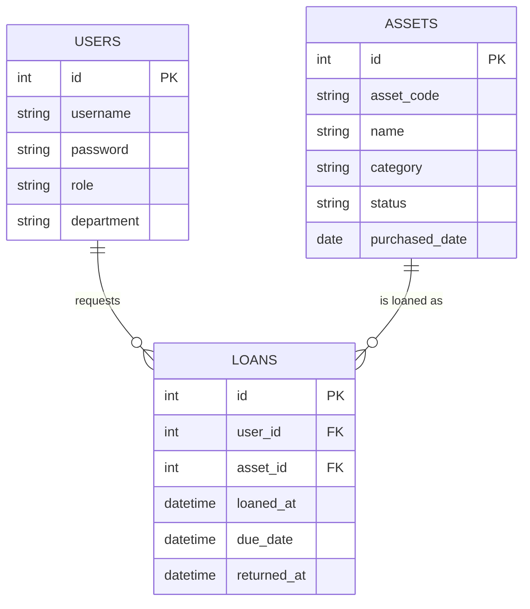

# 資産管理リマインドアプリ
オリジナルアプリ開発。Spring Boot / MySQL で構築。

## 要件定義
### 1. 背景・目的
現在、資産管理はRedmineのチケット機能を用いて管理を行っているが、以下の課題がある。
- 部署別・資産種別ごとの保有数など、集計を必要とする場面で一覧から手動で数える必要があり非効率
- 返却期限の管理はチケットのステータスを目視で確認する運用になっており、リマインド機能がないため常に自分で期限を確認する必要がある
- 上記により業務が属人化しやすく、担当者が休暇等で不在の場合に確認が漏れ、期限超過のリスクや他の作業者への皺寄せが生じる

**目的**：この課題を解消するために、資産の集計・検索を容易にし、返却期限を自動検知してリマインド通知を行う資産管理アプリを開発する。
### 2. 想定ユーザー

**実作業者**：PCと付属品を返却・貸出、自分の貸出状況を確認する
- 貸出処理
- 返却処理
- 検索

**管理者**：資産の登録・棚卸し・貸出/返却処理・全体の状況把握を行う
- ユーザー管理
- 全PC状況確認
- CSV出力

### 3. 機能一覧

**must（必須）**
- PC/備品の登録・貸出・返却管理（CRUD）
- 検索・絞り込み（部署別、状態別、資産種別）
- ログイン認証・権限管理（管理者/一般ユーザー）
- 貸出期限が近いものをアプリ内でアラート表示（ダッシュボードにバナー表示）

**want（余裕があれば）**
- Google Chat連携
- CSV一括登録・エクスポート（Excel運用からの脱却をアピール）

### 4. 画面一覧

- ログイン画面（ID/PW）
- 資産一覧・検索画面
- 資産詳細/編集画面
- 貸出・返却登録画面
- 管理者ダッシュボード（全体の貸出状況、期限間近の一覧）

### 5. 使用技術

- 言語：Java
- フレームワーク：Spring Boot
- DB：MySQL
- 認証：Spring Security
- （want実装時）外部連携：Google Chat Webhook

### 6. DB設計

**ユーザー**
- id (PK)
- username
- password（ハッシュ化）
- role（ADMIN/USER）
- 部署

**資産**
- id (PK)
- 資産番号 (asset_code)
- 資産名 (name)
- カテゴリー (category)
- status（在庫/貸出中/故障中）
- purchased_date

**貸出履歴**
- id (PK)
- asset_id (FK → assets.id)
- user_id (FK → users.id)
- loaned_at
- due_date
- returned_at（nullable、返却されてなければNULL）

### ER図

